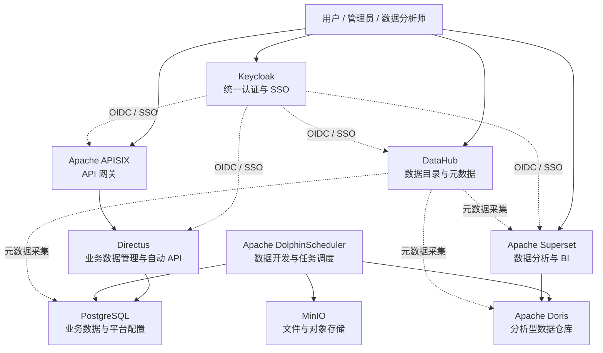

# TechBao Data Platform

TechBao Data Platform 是一个面向企业数据应用建设的开源数据平台项目。当前阶段以“尽可能使用成熟开源平台、尽可能少开发、以系统集成为主”为核心原则，优先完成文档、架构约定和部署目录骨架，为后续组件集成、环境编排和验证工作打基础。

> 当前仓库尚未完成各组件的实际集成，也不包含具体业务代码。

## 项目定位

本项目定位为一套可组合、可替换、可演进的数据平台集成方案，覆盖业务数据管理、数据开发、分析型数仓、数据目录、BI 分析、API 服务、统一认证和对象存储等常见能力。

目标不是从零开发一套平台，而是在成熟开源组件之上建立清晰的集成边界、部署模板、认证体系、元数据治理和运维规范。

## 建设原则

- 开源优先：优先选择社区成熟、生态活跃、文档完善的开源平台。
- 集成优先：尽量通过配置、协议、插件和网关完成能力组合。
- 少量开发：仅在必要的适配层、自动化脚本和扩展点中进行有限开发。
- 标准接口：优先使用 SQL、REST、OpenAPI、OIDC、S3、JDBC 等通用接口。
- 渐进落地：先完成最小可运行环境，再逐步补齐治理、监控、安全和高可用。
- 不绑定业务：仓库当前只建立平台骨架，不引入具体业务模型和业务流程。

## 产品模块

- 业务数据管理：基于 Directus 管理业务数据模型、权限和自动 API。
- 业务数据库：基于 PostgreSQL 承载业务数据和平台配置数据。
- 分析型数据仓库：基于 Apache Doris 承载明细层、汇总层和分析服务。
- 数据开发与调度：基于 Apache DolphinScheduler 编排数据同步、加工和调度任务。
- 数据分析与 BI：基于 Apache Superset 构建仪表盘、报表和自助分析。
- 数据目录与元数据：基于 DataHub 管理数据资产、血缘、标签和责任人。
- API 服务与网关：基于 Apache APISIX 统一暴露 API、路由、鉴权和限流。
- 统一认证与 SSO：基于 Keycloak 提供 OIDC/SAML 单点登录和身份管理。
- 文件与对象存储：基于 MinIO 提供 S3 兼容对象存储能力。

## 总体架构图

## 开源组件清单

| 组件 | 规划职责 | 当前状态 |
| --- | --- | --- |
| Directus | 业务数据管理、权限配置、自动 API | 规划中 |
| PostgreSQL | 业务数据、平台配置、组件依赖存储 | 规划中 |
| Apache Doris | 分析型数据仓库、OLAP 查询服务 | 规划中 |
| Apache DolphinScheduler | 数据开发、任务编排、调度运行 | 规划中 |
| Apache Superset | 数据分析、报表、BI 仪表盘 | 规划中 |
| DataHub | 数据目录、元数据、血缘、标签 | 规划中 |
| Apache APISIX | API 网关、路由、鉴权、限流 | 规划中 |
| Keycloak | 统一认证、SSO、身份与角色管理 | 规划中 |
| MinIO | 文件存储、对象存储、S3 兼容接口 | 规划中 |

## 实施路线

1. 项目初始化：建立文档、部署目录和 ADR，明确集成优先原则。
2. 本地验证环境：提供 Docker Compose 草案，验证核心组件单机启动。
3. 认证集成：验证 Keycloak 与 Directus、Superset、DataHub、APISIX 的 SSO 方案。
4. 数据链路验证：验证 PostgreSQL 到 Doris 的同步、调度和质量检查链路。
5. 元数据治理：验证 DataHub 对 PostgreSQL、Doris、Superset 的元数据采集。
6. API 出口治理：通过 APISIX 统一开放 Directus 和后续平台 API。
7. Kubernetes 部署：沉淀 Helm、Kustomize 或 GitOps 方向的部署规范。
8. 运维与安全：补齐日志、监控、备份、权限、安全基线和升级流程。

## 当前项目状态

- 已建立开源项目文档骨架。
- 已建立部署、脚本和示例目录骨架。
- 尚未引入具体业务代码。
- 尚未提供可直接运行的 Compose 或 Kubernetes 编排文件。
- 尚未完成任何组件之间的实际集成验证。

## 文档入口

- [路线图](docs/00-roadmap/roadmap.md)
- [里程碑](docs/00-roadmap/milestones.md)
- [产品概览](docs/01-product/overview.md)
- [产品架构](docs/01-product/architecture.md)
- [技术栈](docs/02-technology/tech-stack.md)
- [组件选型](docs/02-technology/component-selection.md)
- [集成架构](docs/02-technology/integration-architecture.md)
- [部署说明](docs/04-deployment/local-deployment.md)
- [架构决策记录](docs/adr/0001-open-source-integration-first.md)

## 许可证

本项目使用 MIT License，详见 [LICENSE](LICENSE)。
