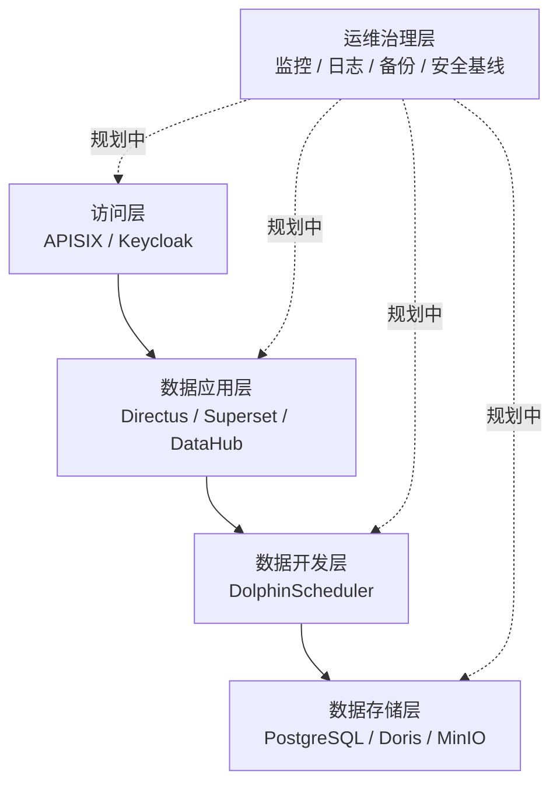

# 产品架构

产品架构围绕“入口统一、能力分层、组件自治、标准集成”展开。

## 能力分层

## 设计说明

- 访问层负责统一入口、认证协同、路由和 API 治理。
- 数据应用层提供低代码数据管理、BI 分析和数据目录。
- 数据开发层负责任务编排、同步、加工和调度。
- 数据存储层分别承载业务数据、分析数据和对象文件。
- 运维治理层当前为规划内容，后续补齐监控、日志、备份和安全能力。

## 集成边界

各组件尽量保持自治，平台侧主要维护以下边界：

- 身份边界：由 Keycloak 提供统一身份源。
- API 边界：由 APISIX 作为统一 API 出口。
- 数据边界：PostgreSQL 面向业务与配置，Doris 面向分析，MinIO 面向对象存储。
- 元数据边界：DataHub 采集和管理跨组件数据资产。
